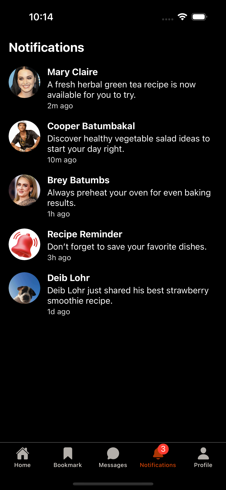

## VeggieMate App

Discover delicious vegetarian recipes made simple. From quick meals to wholesome favorites, VeggieMate helps you cook healthier every day. Easy steps, tasty results, plant-powered living.

## Features

- User Authentication: Sign up and log in securely to access personalized features.
- Post Recipes: Share your own vegetarian recipes with images and videos.
- Repost Recipes: Re-share recipes from other users to inspire your followers.
- Engagement Tools:
   - Like and comment on recipes
   - Cooked Button – track how many users have cooked the recipe
   - Bookmark recipes to save for later
- Messaging & Notifications:
   - Direct messages with other users
   - Real-time notifications for likes, comments, reposts, and new followers
- Categories & Popular Section: Easily browse recipes by category or check out what’s trending.
- Ingredients & Instructions: Every recipe comes with a detailed ingredient list and step-by-step guide.

## Screenshots

## Future Enhancements

- Profile customization (bio)
- Advanced search and filters (by ingredients, time, difficulty)
- Weekly meal planner 
- Video tutorials and step-by-step cooking mode
- Social sharing to other platforms (Facebook, Instagram, etc.)
- Push notifications for new recipes in followed categories
- Light mode support for better usability
- Offline recipe access 

## About

This project is part of my learning journey in React Native and is designed as a social recipe-sharing app focused on vegetarian cooking.

## Developer

Developed by Mia Myca Tresenio

## License

This project is licensed under the [MIT License](./LICENSE).

